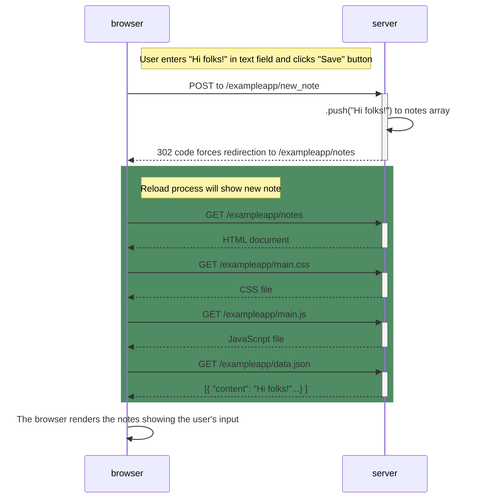

```mermaid
sequenceDiagram
    participant browser
    participant server

    Note right of browser: User enters "Hi folks!" in text field and clicks "Save" button
    browser->>+server: POST to /exampleapp/new_note
    server->>server: .push("Hi folks!") to notes array
    server-->>-browser: 302 code forces redirection to /exampleapp/notes

    rect rgb(79, 139, 99)
    Note right of browser: Reload process will show new note
    browser->>+server: GET /exampleapp/notes
    server-->>-browser: HTML document

    browser->>+server: GET /exampleapp/main.css
    server-->>-browser: CSS file

    browser->>+server: GET /exampleapp/main.js
    server-->>-browser: JavaScript file

    browser->>+server: GET /exampleapp/data.json
    server-->>-browser: [{ "content": "Hi folks!"...} ]
    end

    browser->>browser: The browser renders the notes showing the user's input
```