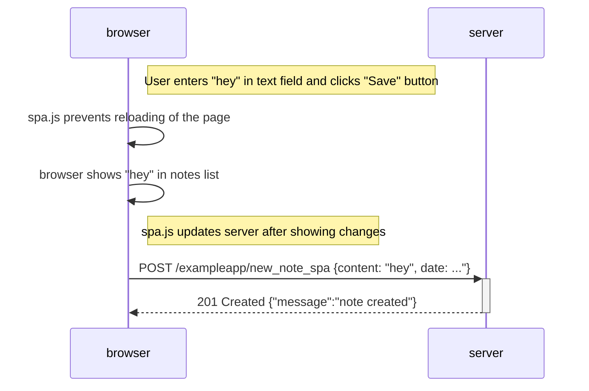

```mermaid
sequenceDiagram
    participant browser
    participant server

    Note right of browser: User enters "hey" in text field and clicks "Save" button

    browser->>browser: spa.js prevents reloading of the page
    browser->>browser: browser shows "hey" in notes list

    Note right of browser: spa.js updates server after showing changes

    browser->>+server: POST /exampleapp/new_note_spa {content: "hey", date: ..."}
    server-->>-browser: 201 Created {"message":"note created"}
```